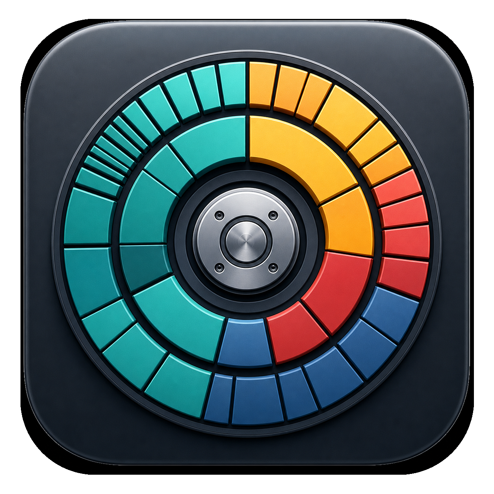
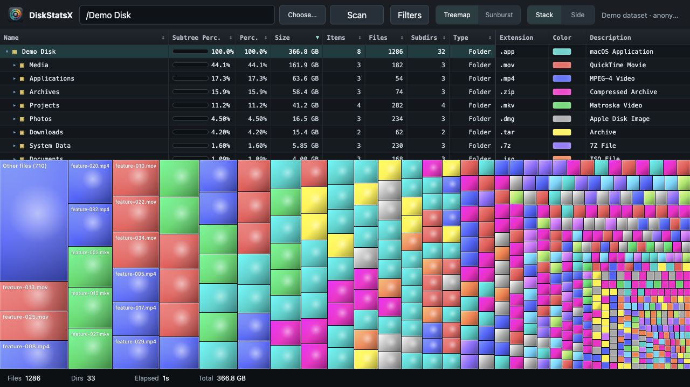
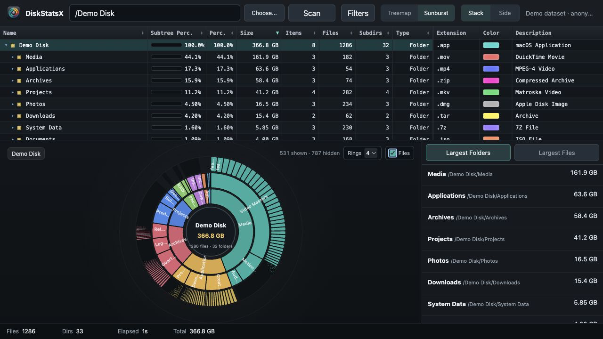

# DiskStatsX

<p align="center">
  
</p>

DiskStatsX is a native macOS disk space analyzer focused on fast metadata enumeration and clear, interactive visualization.

The scanner is written in C and enumerates directories with Apple's `getattrlistbulk()` API. Results are streamed through a local Node.js service and rendered as an interactive Treemap or Sunburst inside an Electron desktop app.

## Highlights

- Native macOS scanner using `open()` and `getattrlistbulk()`
- Recursive hierarchy with aggregated allocated sizes
- Live progress over Server-Sent Events
- Cancelable scans
- Native macOS folder picker alongside manual path entry
- Integrated native macOS traffic-light window controls
- Cache, external-volume and system-folder exclusions
- Virtualized directory tree for very large scans
- OffscreenCanvas Treemap rendered in a Web Worker
- Budgeted D3 Sunburst with zoom, ring controls and file filtering
- Finder integration and contextual file actions
- Apple Silicon desktop packaging

## Screenshots

### Treemap



### Sunburst



## Requirements

- macOS 12 or newer
- Apple Clang / Xcode Command Line Tools
- Node.js 20 or newer
- npm 10 or newer

DiskStatsX is intentionally macOS-only. The native scanner depends directly on Darwin filesystem APIs.

## Development

```bash
npm install
make
npm start
```

Open [http://127.0.0.1:3000](http://127.0.0.1:3000).

To run the Electron application:

```bash
npm run desktop
```

The desktop build exposes a native macOS directory picker through an isolated Electron preload bridge. Manual path entry remains available.

For documentation screenshots and UI development:

```text
http://127.0.0.1:3000/?demo=1
```

Demo mode is deterministic and never reads the local filesystem.

## Build

```bash
npm run package:mac
```

Artifacts are written to `dist/`. The default local build is unsigned and targets the architecture of the build machine.

## Quality Checks

```bash
npm run check
```

This compiles the native scanner, runs ESLint, exercises the real scanner through the HTTP API, and verifies cancellation behavior.

## Filesystem Permissions

macOS privacy controls can restrict folders such as Mail, Messages and parts of the user Library. For full-disk scans, grant **Full Disk Access** to DiskStatsX in:

`System Settings > Privacy & Security > Full Disk Access`

The scanner skips permission errors and symbolic links.

## Architecture

```text
getattrlistbulk() native scanner
              |
              v
       JSON filesystem tree
              |
              v
  ScanManager + Express + SSE
              |
              v
 Electron / browser ES modules
      |                 |
      v                 v
Offscreen Treemap   D3 Sunburst
```

See [docs/ARCHITECTURE.md](docs/ARCHITECTURE.md) for module boundaries and data flow.

## Security

The HTTP server binds only to `127.0.0.1`, rejects non-loopback hosts and cross-origin requests, and protects private endpoints with an `HttpOnly` local-session cookie. System actions are restricted to an allowlist and all requested paths are resolved before use. See [SECURITY.md](SECURITY.md) for private reporting guidance.

## Contributing

Read [CONTRIBUTING.md](CONTRIBUTING.md) before opening a pull request.

## License

MIT. See [LICENSE](LICENSE).
